## Escuela Colombiana de Ingeniería
### Arquitecturas de Software – ARSW


#### Ejercicio – programación concurrente, condiciones de carrera y sincronización de hilos. EJERCICIO INDIVIDUAL O EN PAREJAS.

##### Parte I – Antes de terminar la clase.

Control de hilos con wait/notify. Productor/consumidor.

1. Revise el funcionamiento del programa y ejecútelo. Mientras esto ocurren, ejecute jVisualVM y revise el consumo de CPU del proceso correspondiente.
   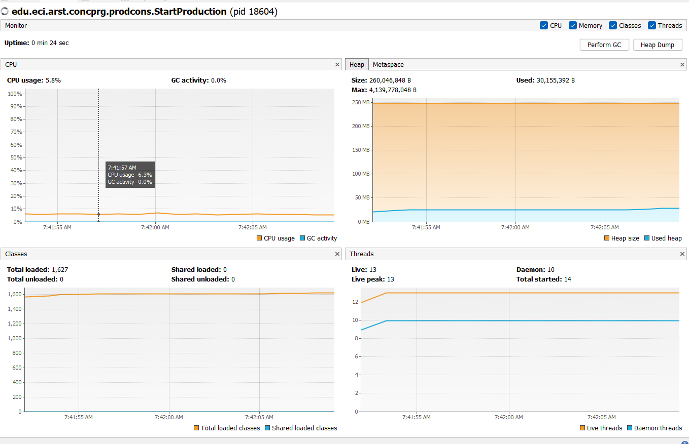
   A qué se debe este consumo? Se estan creando dos hilos que interatuan sobre una Queue compartida
   cual es la clase responsable? StartProduction crea los hilos y los pone a correr
2. Haga los ajustes necesarios para que la solución use más eficientemente la CPU, teniendo en cuenta que -por ahora- la producción es lenta y el consumo es rápido. Verifique con JVisualVM que el consumo de CPU se reduzca.
   Aqui sincronizamos los hilos de manera que se pueda compartir la cola de manera adecuada y no se pierdan recursos en tiempo de ejecucion pues al hacerle wait a un hilo este para de consumir recursos
   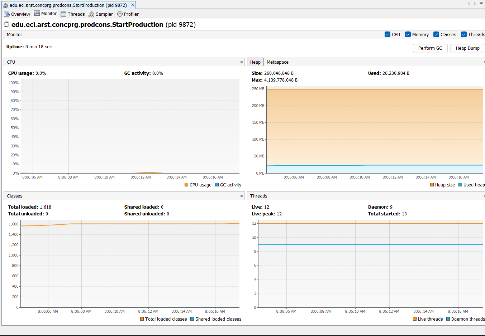

3. Haga que ahora el productor produzca muy rápido, y el consumidor consuma lento. Teniendo en cuenta que el productor conoce un límite de Stock (cuantos elementos debería tener, a lo sumo en la cola), haga que dicho límite se respete. Revise el API de la colección usada como cola para ver cómo garantizar que dicho límite no se supere. Verifique que, al poner un límite pequeño para el 'stock', no haya consumo alto de CPU ni errores.

en el consumer
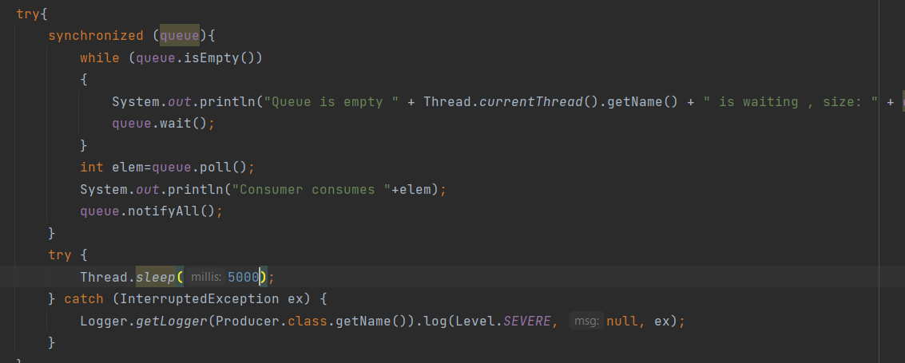
en el producer
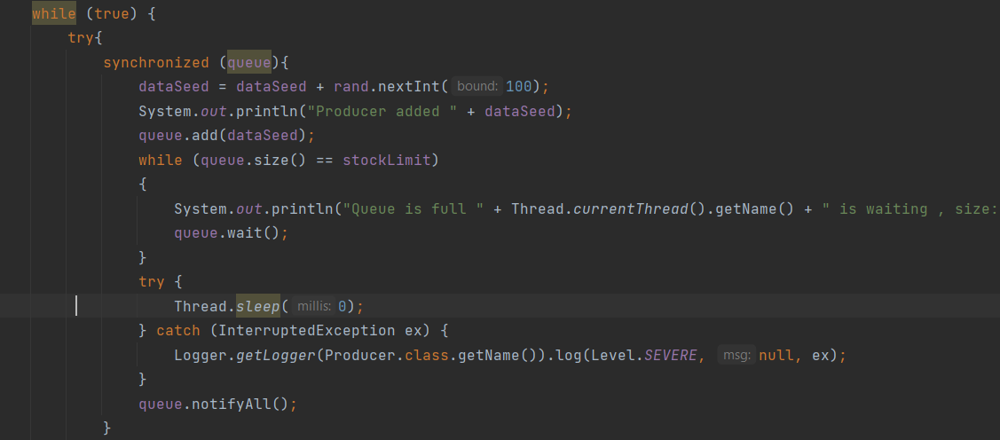
rendimiento
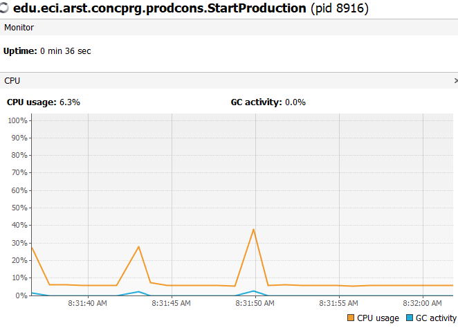
Numero pequeño stock
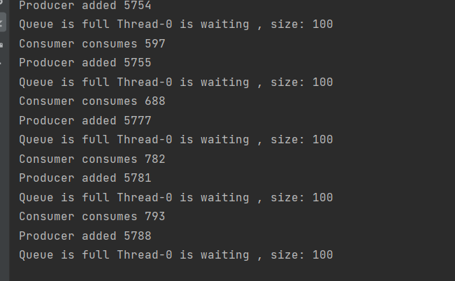
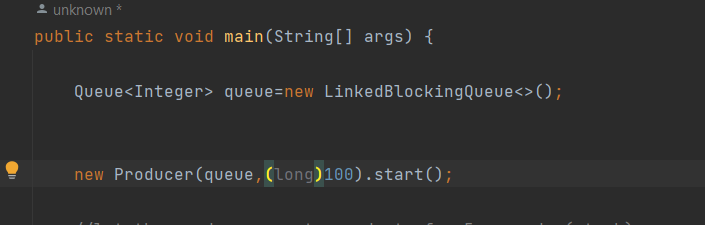
el rendimiento
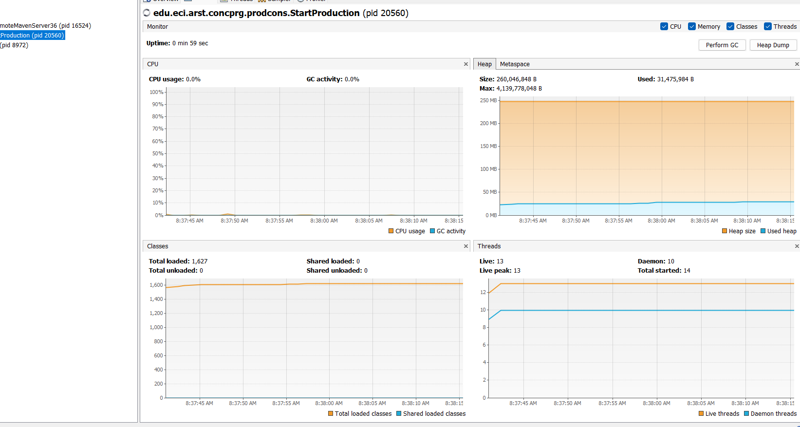

##### Parte II. – Antes de terminar la clase.

Teniendo en cuenta los conceptos vistos de condición de carrera y sincronización, haga una nueva versión -más eficiente- del ejercicio anterior (el buscador de listas negras). En la versión actual, cada hilo se encarga de revisar el host en la totalidad del subconjunto de servidores que le corresponde, de manera que en conjunto se están explorando la totalidad de servidores. Teniendo esto en cuenta, haga que:

- La búsqueda distribuida se detenga (deje de buscar en las listas negras restantes) y retorne la respuesta apenas, en su conjunto, los hilos hayan detectado el número de ocurrencias requerido que determina si un host es confiable o no (_BLACK_LIST_ALARM_COUNT_).
- Lo anterior, garantizando que no se den condiciones de carrera.

##### Parte III. – Avance para el martes, antes de clase.

Sincronización y Dead-Locks.


1. Revise el programa “highlander-simulator”, dispuesto en el paquete edu.eci.arsw.highlandersim. Este es un juego en el que:

	* Se tienen N jugadores inmortales.
	* Cada jugador conoce a los N-1 jugador restantes.
	* Cada jugador, permanentemente, ataca a algún otro inmortal. El que primero ataca le resta M puntos de vida a su contrincante, y aumenta en esta misma cantidad sus propios puntos de vida.
	* El juego podría nunca tener un único ganador. Lo más probable es que al final solo queden dos, peleando indefinidamente quitando y sumando puntos de vida.

2. Revise el código e identifique cómo se implementó la funcionalidad antes indicada. Dada la intención del juego, un invariante debería ser que la sumatoria de los puntos de vida de todos los jugadores siempre sea el mismo(claro está, en un instante de tiempo en el que no esté en proceso una operación de incremento/reducción de tiempo). Para este caso, para N jugadores, cual debería ser este valor?.

   Para N jugadores el valor de este invariante debería ser la constante DEFAULT_IMMORTAL_HEALTH multiplicada por los N jugadores.
   Si son 6 jugadores y se establece 100 de vida el invariante debe ser 600.

3. Ejecute la aplicación y verifique cómo funcionan la opción ‘pause and check’. ¿Se cumple el invariante?.

   Actualmente no se está cumpliendo el invariante:

   

4. Una primera hipótesis para que se presente la condición de carrera para dicha función (pause and check), es que el programa consulta la lista cuyos valores va a imprimir, a la vez que otros hilos modifican sus valores. Para corregir esto, haga lo que sea necesario para que efectivamente, antes de imprimir los resultados actuales, se pausen todos los demás hilos. Adicionalmente, implemente la opción ‘resume’.

   Se implementa la función de pausa y des pausa además de cumplir el invariante:

   
   


5. Verifique nuevamente el funcionamiento (haga clic muchas veces en el botón). ¿Se cumple o no el invariante?.

   Si, aun se cumple el invariante para varios clicks
   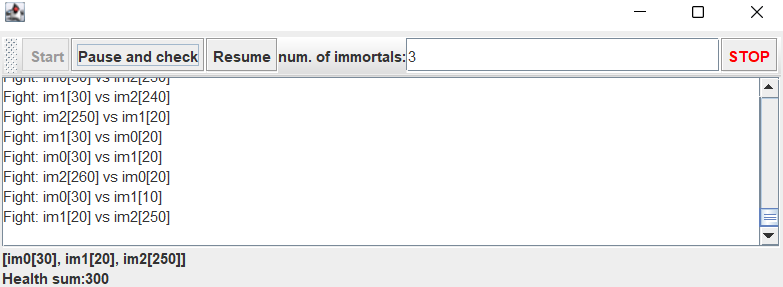

6. Identifique posibles regiones críticas en lo que respecta a la pelea de los inmortales. Implemente una estrategia de bloqueo que evite las condiciones de carrera. Recuerde que si usted requiere usar dos o más ‘locks’ simultáneamente, puede usar bloques sincronizados anidados:

   ```java
   synchronized(locka){
       synchronized(lockb){
           …
       }
   }
   ```
En este caso no identificamos mas regiones criticas pues el programa funciona correctamente para n inmortales ya que
que tenemos un sincronize sobre fight
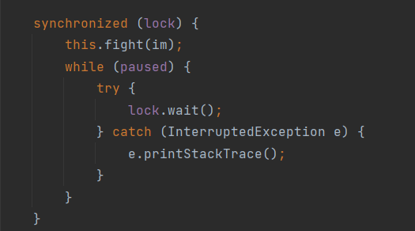

7. Tras implementar su estrategia, ponga a correr su programa, y ponga atención a si este se llega a detener. Si es así, use los programas jps y jstack para identificar por qué el programa se detuvo.

el programa no se detiene incluso con 1000

8. Plantee una estrategia para corregir el problema antes identificado (puede revisar de nuevo las páginas 206 y 207 de _Java Concurrency in Practice_).

9. Una vez corregido el problema, rectifique que el programa siga funcionando de manera consistente cuando se ejecutan 100, 1000 o 10000 inmortales. Si en estos casos grandes se empieza a incumplir de nuevo el invariante, debe analizar lo realizado en el paso 4.

Con 100 el programa no se detiene y no ocurren discordancias
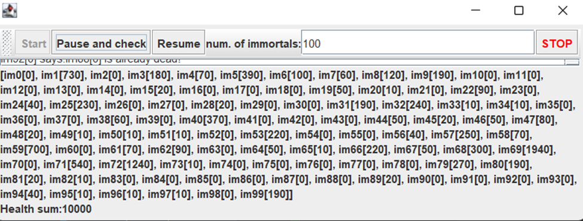
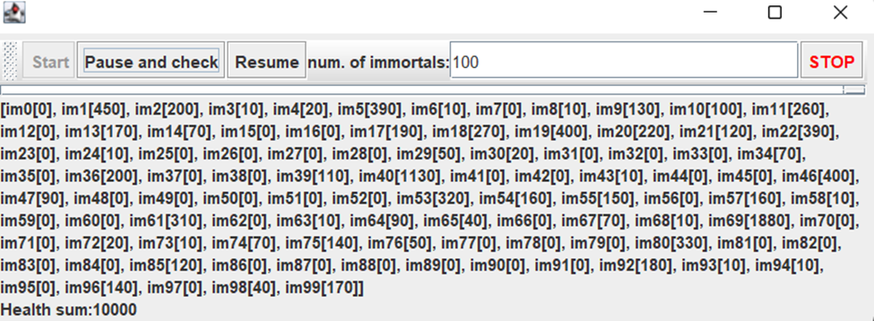

Con 1000 el programa no se detiene y no ocurren discordancias
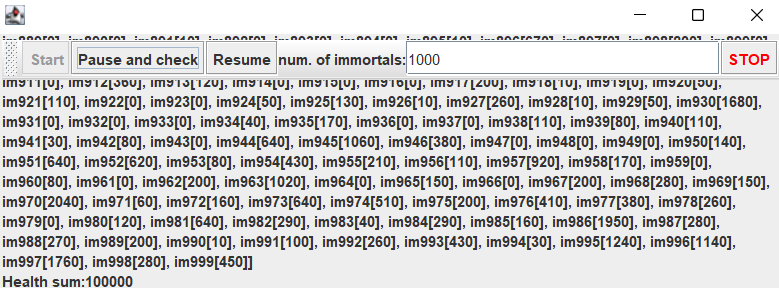

Con 10000 el programa no se detiene pero ocurren discordancias
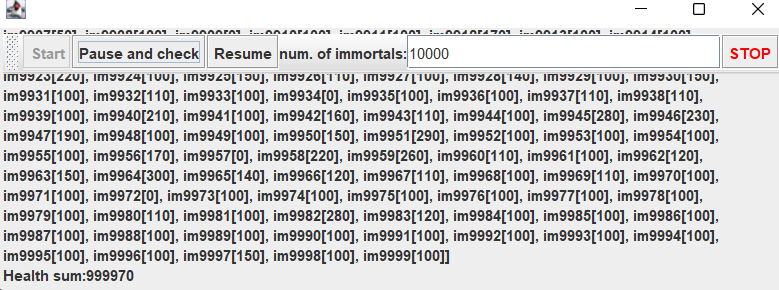
    Entonces vamos a retomar desde el paso 4
    encontrando las siguientes regiones criticas
    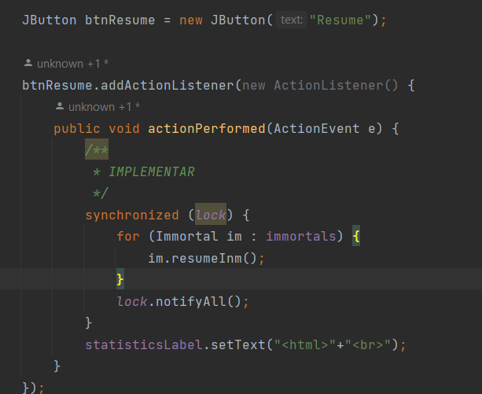
    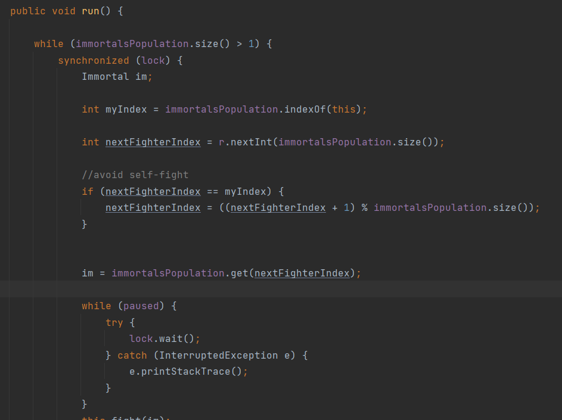
        

10. Un elemento molesto para la simulación es que en cierto punto de la misma hay pocos 'inmortales' vivos realizando peleas fallidas con 'inmortales' ya muertos. Es necesario ir suprimiendo los inmortales muertos de la simulación a medida que van muriendo. Para esto:
	* Analizando el esquema de funcionamiento de la simulación, esto podría crear una condición de carrera? Implemente la funcionalidad, ejecute la simulación y observe qué problema se presenta cuando hay muchos 'inmortales' en la misma. Escriba sus conclusiones al respecto en el archivo RESPUESTAS.txt.:
    varios hilos generan el problema de los deadloack mas fuerte y tambien producen que al querer leer de la lista existan
    incongruencias pues puede que el hilo que se vaya a leer ya haya sido eliminado
    
    * Corrija el problema anterior __SIN hacer uso de sincronización__, pues volver secuencial el acceso a la lista 
    compartida de inmortales haría extremadamente lenta la simulación:
    para no poner bloqueos a la lista vamos a poner regiones criticas en las condiciones de carrera (estas regiones 
    estan expuestas en el punto 9)

11. Para finalizar, implemente la opción STOP.

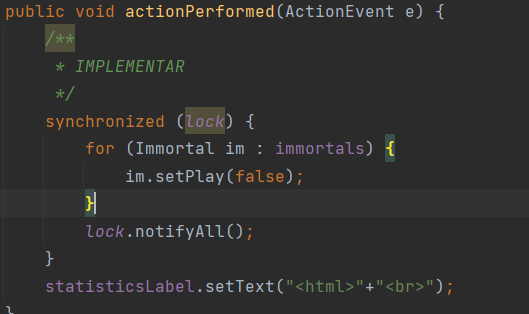


### Criterios de evaluación

1. Parte I.
	* Funcional: La simulación de producción/consumidor se ejecuta eficientemente (sin esperas activas).

2. Parte II. (Retomando el laboratorio 1)
	* Se modificó el ejercicio anterior para que los hilos llevaran conjuntamente (compartido) el número de ocurrencias encontradas, y se finalizaran y retornaran el valor en cuanto dicho número de ocurrencias fuera el esperado.
	* Se garantiza que no se den condiciones de carrera modificando el acceso concurrente al valor compartido (número de ocurrencias).


2. Parte III.
	* Diseño:
		- Coordinación de hilos:
			* Para pausar la pelea, se debe lograr que el hilo principal induzca a los otros a que se suspendan a sí mismos. Se debe también tener en cuenta que sólo se debe mostrar la sumatoria de los puntos de vida cuando se asegure que todos los hilos han sido suspendidos.
			* Si para lo anterior se recorre a todo el conjunto de hilos para ver su estado, se evalúa como R, por ser muy ineficiente.
			* Si para lo anterior los hilos manipulan un contador concurrentemente, pero lo hacen sin tener en cuenta que el incremento de un contador no es una operación atómica -es decir, que puede causar una condición de carrera- , se evalúa como R. En este caso se debería sincronizar el acceso, o usar tipos atómicos como AtomicInteger).

		- Consistencia ante la concurrencia
			* Para garantizar la consistencia en la pelea entre dos inmortales, se debe sincronizar el acceso a cualquier otra pelea que involucre a uno, al otro, o a los dos simultáneamente:
			* En los bloques anidados de sincronización requeridos para lo anterior, se debe garantizar que si los mismos locks son usados en dos peleas simultánemante, éstos será usados en el mismo orden para evitar deadlocks.
			* En caso de sincronizar el acceso a la pelea con un LOCK común, se evaluará como M, pues esto hace secuencial todas las peleas.
			* La lista de inmortales debe reducirse en la medida que éstos mueran, pero esta operación debe realizarse SIN sincronización, sino haciendo uso de una colección concurrente (no bloqueante).

	

	* Funcionalidad:
		* Se cumple con el invariante al usar la aplicación con 10, 100 o 1000 hilos.
		* La aplicación puede reanudar y finalizar(stop) su ejecución.
		
		-->

<a rel="license" href="http://creativecommons.org/licenses/by-nc/4.0/"></a><br />Este contenido hace parte del curso Arquitecturas de Software del programa de Ingeniería de Sistemas de la Escuela Colombiana de Ingeniería, y está licenciado como <a rel="license" href="http://creativecommons.org/licenses/by-nc/4.0/">Creative Commons Attribution-NonCommercial 4.0 International License</a>.
